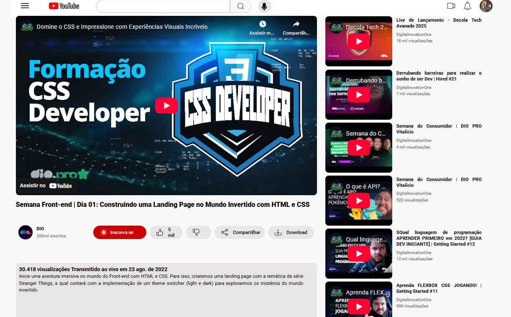

## 👨‍💻 Desafio de Projeto CSS: Clonando a Página do Youtube com CSS
Projeto de HMTL e CSS de Clone da página do Youtube utilizando Flexbox.  
Esse projeto foi proposto pela expert Michele Ambrosio da plataforma educacional DIO na Formação CSS Developer.

## 💻 Tecnologias usadas:

  
  

## 🖥 Preview:

- Venha ver como ficou o projeto acessando [aqui nesse link do GithubPages](**https://nuriamendonca.github.io/clone_youtube/**)

## 🤔 O que foi feito nesse projeto:
- Crei um clone da página do Youtube utilizando os conceitos de Flexbox;
- Neste projeto segui as orientações do arquivo do Figma disponibilizado no curso.

